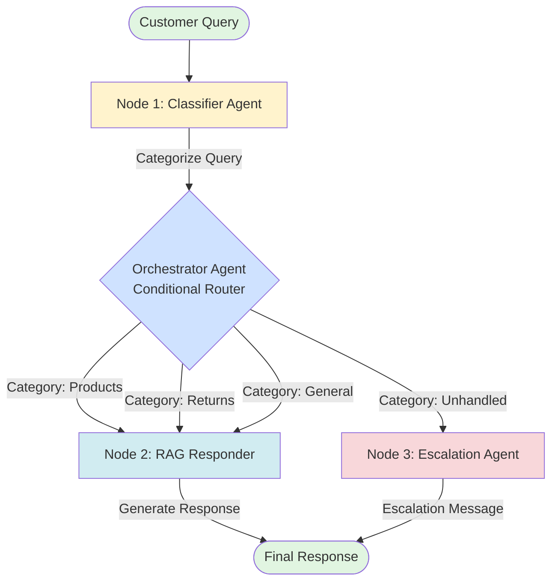

# LangGraph Workflow for TechGear Electronics Customer Support Chatbot

## Overview
This workflow implements a multi-agent system using LangGraph for intelligent customer support routing and response generation.

## Workflow Architecture



## Node Descriptions

### **Node 1: Classifier Agent**
**Purpose:** Categorize incoming customer queries into predefined categories

**Categories:**
- `products` - Questions about product specifications, prices, features
- `returns` - Questions about return policy, refunds, exchanges
- `general` - Questions about support, contact info, warranty, shipping
- `unhandled` - Queries that don't fit any category or are out of scope

**Input:** Customer query string

**Output:** 
```json
{
  "category": "products|returns|general|unhandled",
  "confidence": 0.0-1.0,
  "reasoning": "Brief explanation"
}
```

**Implementation:**
- Uses Google Gemini LLM
- Structured output with Pydantic model
- Falls back to "unhandled" for low confidence

---

### **Orchestrator Agent (Conditional Router)**
**Purpose:** Route queries to appropriate handler based on classification

**Routing Logic:**
```python
if category in ["products", "returns", "general"]:
    route_to -> RAG Responder
elif category == "unhandled":
    route_to -> Escalation Agent
```

**Decision Factors:**
- Classification category
- Confidence score (threshold: 0.7)
- Query complexity

---

### **Node 2: RAG Responder**
**Purpose:** Generate accurate responses using Retrieval Augmented Generation

**Process:**
1. **Retrieve** - Search ChromaDB for top 4 relevant chunks
2. **Augment** - Add retrieved context to prompt
3. **Generate** - Use Gemini to create response

**Input:**
```json
{
  "query": "Customer question",
  "category": "products|returns|general",
  "context": "Retrieved knowledge base chunks"
}
```

**Output:**
```json
{
  "response": "Detailed answer",
  "sources": ["doc_id_1", "doc_id_2"],
  "confidence": 0.0-1.0
}
```

**Prompt Template:**
```
You are a helpful customer support assistant for TechGear Electronics.
Category: {category}
Context: {context}
Question: {query}

Provide a professional, accurate response based on the context.
```

---

### **Node 3: Escalation Agent**
**Purpose:** Handle queries that cannot be processed automatically

**Triggers:**
- Category is "unhandled"
- Confidence score < 0.7
- RAG response indicates missing information

**Output Message:**
```
I apologize, but I need to connect you with a human agent for this request.

Your query: "{query}"

Our support team will assist you with:
- Complex technical issues
- Account-specific inquiries
- Special requests

Contact Information:
📧 Email: support@techgear.com
📞 Hours: Mon-Sat, 9AM-6PM IST

A support agent will respond within 24 hours.
```

---

## Complete Workflow Flow

```
┌─────────────────────────────────────────────────────────────────┐
│                        START: Customer Query                      │
└────────────────────────────┬──────────────────────────────────────┘
                             │
                             ▼
┌─────────────────────────────────────────────────────────────────┐
│                    NODE 1: CLASSIFIER AGENT                       │
│                                                                   │
│  - Analyze query intent                                          │
│  - Categorize: products/returns/general/unhandled                │
│  - Calculate confidence score                                    │
│  - Return classification result                                  │
└────────────────────────────┬──────────────────────────────────────┘
                             │
                             ▼
┌─────────────────────────────────────────────────────────────────┐
│              ORCHESTRATOR: CONDITIONAL ROUTER                     │
│                                                                   │
│  IF category == "products" OR "returns" OR "general"             │
│      AND confidence >= 0.7                                        │
│      THEN → Route to RAG Responder                               │
│                                                                   │
│  ELSE IF category == "unhandled" OR confidence < 0.7             │
│      THEN → Route to Escalation Agent                            │
└─────────────┬────────────────────────────────┬──────────────────┘
              │                                │
              │ products/returns/general       │ unhandled
              │                                │
              ▼                                ▼
┌──────────────────────────────┐  ┌──────────────────────────────┐
│   NODE 2: RAG RESPONDER      │  │  NODE 3: ESCALATION AGENT    │
│                              │  │                              │
│  1. Query ChromaDB           │  │  - Generate escalation msg   │
│  2. Retrieve relevant docs   │  │  - Include contact info      │
│  3. Build context            │  │  - Log for human review      │
│  4. Generate response        │  │  - Return helpful message    │
│  5. Return answer            │  │                              │
└──────────────┬───────────────┘  └──────────────┬───────────────┘
               │                                  │
               └──────────────┬───────────────────┘
                              │
                              ▼
               ┌──────────────────────────────┐
               │     FINAL RESPONSE           │
               │     Return to Customer       │
               └──────────────────────────────┘
```

---

## State Schema

The workflow maintains state through the graph:

```python
from typing import TypedDict, Literal

class WorkflowState(TypedDict):
    # Input
    query: str
    
    # Classification
    category: Literal["products", "returns", "general", "unhandled"]
    confidence: float
    reasoning: str
    
    # RAG
    retrieved_docs: list[str]
    context: str
    
    # Output
    response: str
    node_executed: str
    requires_escalation: bool
```

---

## Example Flows

### **Example 1: Product Query (Success Flow)**
```
Query: "What is the price of SmartWatch Pro X?"

1. Classifier Agent:
   - Category: "products"
   - Confidence: 0.95
   - Reasoning: "Direct product price inquiry"

2. Orchestrator: Route to RAG Responder

3. RAG Responder:
   - Retrieved: SmartWatch Pro X product info
   - Response: "The SmartWatch Pro X is priced at ₹15,999..."

4. Output: Detailed answer with price and features
```

### **Example 2: Returns Query (Success Flow)**
```
Query: "What is your return policy?"

1. Classifier Agent:
   - Category: "returns"
   - Confidence: 0.98
   - Reasoning: "Asking about return policy"

2. Orchestrator: Route to RAG Responder

3. RAG Responder:
   - Retrieved: Return policy information
   - Response: "We offer a 7-day no-questions-asked return policy..."

4. Output: Complete return policy details
```

### **Example 3: Unhandled Query (Escalation Flow)**
```
Query: "Can you help me hack into my competitor's system?"

1. Classifier Agent:
   - Category: "unhandled"
   - Confidence: 0.99
   - Reasoning: "Inappropriate/illegal request"

2. Orchestrator: Route to Escalation Agent

3. Escalation Agent:
   - Generate escalation message
   - Include support contact info
   - Flag for review

4. Output: Professional escalation message
```

### **Example 4: Low Confidence (Escalation Flow)**
```
Query: "The thing doesn't work with the other thing"

1. Classifier Agent:
   - Category: "general"
   - Confidence: 0.45
   - Reasoning: "Too vague, unclear intent"

2. Orchestrator: Route to Escalation Agent (low confidence)

3. Escalation Agent:
   - Request clarification
   - Provide contact options

4. Output: Request for more specific information
```

---

## Implementation Details

### **LangGraph Components Used:**

1. **StateGraph** - Main graph structure
2. **Nodes** - Individual agent functions
3. **Conditional Edges** - Routing logic
4. **State** - Shared data between nodes

### **Key Features:**

- ✅ Multi-agent orchestration
- ✅ Conditional routing based on classification
- ✅ RAG-powered responses
- ✅ Graceful error handling
- ✅ Human escalation fallback
- ✅ State management
- ✅ Logging and monitoring

### **Error Handling:**

```python
try:
    # Execute node logic
    result = process_query(state)
except Exception as e:
    # Fallback to escalation
    return {
        "requires_escalation": True,
        "response": generate_escalation_message(),
        "error": str(e)
    }
```

---

## Next Steps for Implementation

1. Create `classifier_agent.py` - Implement Node 1
2. Create `rag_responder.py` - Implement Node 2
3. Create `escalation_agent.py` - Implement Node 3
4. Create `langgraph_workflow.py` - Orchestrate all nodes
5. Add state management and routing logic
6. Test with sample queries
7. Deploy and monitor

---

## Performance Metrics to Track

- Classification accuracy
- RAG response relevance
- Escalation rate
- Response time
- Customer satisfaction
- Successful query resolution rate

---

**Status:** ✅ Architecture Defined - Ready for Implementation
